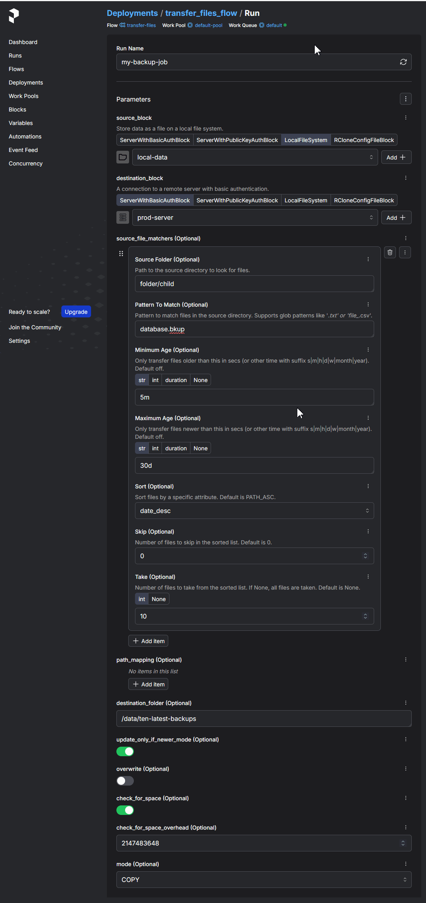

# Prefect Managed File Transfer

<p align="center">
    <!--- Insert a cover image here -->
    <!--- <br> -->
    <a href="https://pypi.python.org/pypi/prefect-managedfiletransfer/" alt="PyPI version">
        </a>
    <a href="https://github.com/ImperialCollegeLondon/prefect-managedfiletransfer/" alt="Stars">
        </a>
    <a href="https://pypistats.org/packages/prefect-managedfiletransfer/" alt="Downloads">
        </a>
    <a href="https://github.com/ImperialCollegeLondon/prefect-managedfiletransfer/pulse" alt="Activity">
        </a>
    <br>
</p>

Turn a prefect.io server into a managed file transfer solution. UI and Programatic creation of cron style jobs (aka Flows!) to upload and download files easily between servers. Support local, SFTP remotes plus any Cloud storage supported by rclone -  so thats aws, azure, google, sharepoint, and [many more](https://rclone.org/overview/) out of the box.

Using prefect for managed file transfer means retries, logging, multi node and [high availability](https://docs.prefect.io/v3/advanced/self-hosted) come as standard - turning prefect into a reliable enterprise ready file transfer solution. 

This package is not the fastest solution to move files around, but it prioritises reliability and ease of use, making it an excellent choice for replacing both quick cron job copy scripts and enterprise managed file transfer applicances.

Key features

- Copy and move files between almost any storage system easily.
- Reliable file moving with checksumming, file size checking etc.
- Smart and safe moving - settings to allow/block overwriting and to only copy files if they are new or changed.
- Unzip/Untar compressed folders after downloading them.
- Repath files as you move them.
- Complex filtering and ordering of files - by path, age, size etc. Pattern matching with regular expressions.
- Leverage Prefect.IO built in scheduling and orchestration capabilities:
    - Transfer files on complex cron schedules
    - notifications on success/failure - slack, email, etc
    - Highly available server architecture - database server + multi-node workers and front ends.

Example use cases:

- Once per day SSH into my database server and copy the latest *.bkup file to a central storage location.
- Monitor a local network share directory for new files and automatically upload them to a cloud storage bucket.
- Schedule a weekly job to synchronize files between two remote servers.
- Move log files from a SSH available web server older than 30 days to a cold storage location.
- Copy file yyyy-MM-dd.zip from a remote server, where yyyy-MM-dd matches todays date, to a local directory and then unzip it.
- Download any file in an S3 bucket larger than 1GB and store it in a local directory.

### Installation

Install `prefect-managedfiletransfer` with `pip`. (Requires an installation of Python 3.10+.)

```bash
pip install prefect-managedfiletransfer
# or 
uv add prefect-managedfiletransfer
```

We recommend using a Python virtual environment manager such as uv, pipenv, conda or virtualenv.

In one (venv) terminal start a prefect server with logs enabled

```bash
export PREFECT_LOGGING_LEVEL="INFO"
export PREFECT_LOGGING_EXTRA_LOGGERS="prefect_managedfiletransfer"
prefect server start
# OR uv run prefect server start
```

There are many ways to manage infrastructure and code with prefect - here we demonstate starting a local worker:

```bash
export PREFECT_API_URL=http://127.0.0.1:4200/api
# or perhaps export PREFECT_API_URL=http://host.docker.internal:4200/api
export PREFECT_LOGGING_EXTRA_LOGGERS="prefect_managedfiletransfer"
export PREFECT_LOGGING_LEVEL="INFO"
# [Optional] add all logs: export PREFECT_LOGGING_ROOT_LEVEL="INFO"


prefect worker start --pool 'default-pool' --type process
# OR prefect worker start --pool 'default-pool' --type docker

```
    
Install the blocks using the prefect CLI

```bash
prefect block register -m prefect_managedfiletransfer
```

And then deploy the flows. 

```bash
# deploy the flows to run locally
python -m prefect_managedfiletransfer.deploy --local

# OR deploy to run with a docker image - see deploy.py
python -m prefect_managedfiletransfer.deploy --docker

# or a version of the above using uv run:
uv run python -m prefect_managedfiletransfer.deploy --local
uv run python -m prefect_managedfiletransfer.deploy --docker
```

Visit the server UI http://localhost:4200.
1. Create 2 blocks, one source and one destination
2. On the deployments page start a `transfer_files_flow`. Configure your flow run to copy/move files between the 2 blocks.

### Installation via docker - TODO

```bash
# run prefect server in a container port-forwarded to your local machine’s 4200 port:
docker run -d -p 4200:4200 prefecthq/prefect:3-latest -- prefect server start --host 0.0.0.0
```

### Components

**Flows**

- transfer_files_flow - a fully featured flow for transferring files between different storage locations.
- upload_file_flow - a flow for uploading a file to a remote server. Supports pattern matching by date

**Blocks**

- ServerWithBasicAuthBlock - A block for connecting to a server using basic authentication.
- ServerWithPublicKeyAuthBlock - A block for connecting to a server using public key authentication.
- RCloneConfigFileBlock - A block for managing RClone configuration files.

**Tasks**

- list_remote_files_task - A task for listing files in a remote directory.
- download_file_task - A task for downloading a single file from a remote server.
- upload_file_task - A task for uploading a single file to a remote server.
- [TODO] delete_file_task



### Feedback

If you encounter any bugs while using `prefect-managedfiletransfer`, feel free to open an issue in the [prefect-managedfiletransfer](https://github.com/ImperialCollegeLondon/prefect-managedfiletransfer) repository.


Feel free to star or watch [`prefect-managedfiletransfer`](https://github.com/ImperialCollegeLondon/prefect-managedfiletransfer) for updates too!

### Contributing

If you'd like to help contribute to fix an issue or add a feature to `prefect-managedfiletransfer`, please [propose changes through a pull request from a fork of the repository](https://docs.github.com/en/pull-requests/collaborating-with-pull-requests/proposing-changes-to-your-work-with-pull-requests/creating-a-pull-request-from-a-fork).

Here are the steps:

1. [Fork the repository](https://docs.github.com/en/get-started/quickstart/fork-a-repo#forking-a-repository)
2. [Clone the forked repository](https://docs.github.com/en/get-started/quickstart/fork-a-repo#cloning-your-forked-repository)
3. Install the repository and its dependencies:
```
# install uv first, then
uv sync
```

You can also access all the prefect CLI tooling inside a uv managed venv
```
uv venv
source .venv/bin/activate
prefect server start
```

4. Make desired changes
5. Add tests
6. Insert an entry to [CHANGELOG.md](https://github.com/ImperialCollegeLondon/prefect-managedfiletransfer/blob/main/CHANGELOG.md)
7. Install `pre-commit` to perform quality checks prior to commit:
```
pre-commit install
```
8. use the build script to run all the checks and tests:

```
./build.sh
```
8. `git commit`, `git push`, and create a pull request
